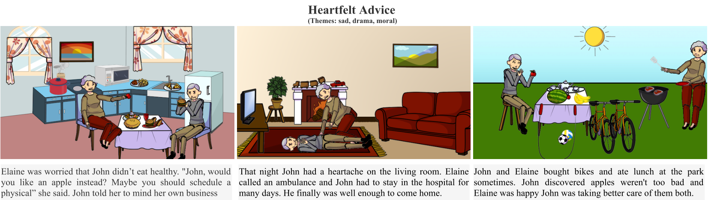

# AESOP: Abstract Encoding of Stories, Objects and Pictures (ICCV 2021)
[Hareesh Ravi](https://hareesh-ravi.github.io/) | [Kushal Kafle](https://kushalkafle.com/) | [Scott Cohen](https://research.adobe.com/person/scott-cohen/) | [Jonathan Brandt](https://research.adobe.com/person/jonathan-brandt/) | [Mubbasir Kapadia](https://ivi.cs.rutgers.edu/) <br>

This is the official repository for our ICCV 2021 paper "AESOP: Abstract Encoding of Stories, Objects and Pictures". <br> 

### Abstract
Visual storytelling and story comprehension are uniquely human skills that play a central role in how we learn about and experience the world. Despite remarkable progress in recent years in synthesis of visual and textual content in isolation and learning effective joint visual-linguistic representations, existing systems still operate only at a superfi cial, factual level. With the goal of developing systems that are able to comprehend rich human-generated narratives, and co-create new stories, we introduce AESOP: a new dataset that captures the creative process associated with visual storytelling. Visual panels are composed of clipart objects with specifi c attributes enabling a broad range of creative expression. Using AESOP, we propose foundational storytelling tasks that are generative variants of story cloze tests, to better measure the creative and causal reasoning ability required for visual storytelling. We further develop a generalized story completion framework that models stories as the co-evolution of visual and textual concepts. We benchmark the proposed approach with human baselines and evaluate using comprehensive qualitative and quantitative metrics. Our results highlight key insights related to the dataset, modelling and evaluation of visual storytelling for future research in this promising field of study.



### ICCV 2021

[Paper](https://openaccess.thecvf.com/content/ICCV2021/papers/Ravi_AESOP_Abstract_Encoding_of_Stories_Objects_and_Pictures_ICCV_2021_paper.pdf) | [Appendix](https://openaccess.thecvf.com/content/ICCV2021/supplemental/Ravi_AESOP_Abstract_Encoding_ICCV_2021_supplemental.pdf) | [Video Presentation](https://youtu.be/ygGzY1DSSMk) | [Poster](./iccv2021/AESOP_ICCV2021_POSTER.pdf) | [Video Slides](./iccv2021/AESOP_ICCV2021_SLIDES.pdf) <br>

---

## DATASET 

Please head over to the [releases tab](https://github.com/adobe-research/aesop/releases/tag/v1.0) to download the current version of the dataset. 
Download the files in `data.zip` to the  `./data` folder for and follow instructions in `./data/README.md` to set it up.

We have also provided pre-rendered scenes in `previews.tar.gz` for ease of viewing the drawn stories. More details are
found in the `./data/README.md`. 

---

## CODE

#### Rendering

- Run `python renderer.py ./data/stories/{storyid}/scene.json --render` to get the 3 images for a story. 

- Run `python renderer.py ./data/stories/{storyid}/scene.json --render --preview --istext`
to generate previews similar to what is present in `./data/previews/`.  

Other options include,
```
--preview_dir - where previews will be saved
--outdir      - where 3 images will be saved
```
#### Utils

- Run `python utils.py --scene2dict --input_path ./data/stories/0000 --output_path ./` to convert scene.json to dict similar to the ones in train.json
- Run `python utils.py --dict2scene --input_path ./0000/story_dict.json --output_path ./` to convert list of object dict to scene.json. This is useful to render new images predicted by your models. First put them in the json format present in train/test.json and then use this code to get scene.json and meta.json. After that, use the renderer above to render.

Optionally if you had downloaded all the data to a different directory than `./data`, then provide the root data directory as input:

`python utils.py --scene2dict --input_path ./data/stories/0000 --output_path ./ --data_root /home/data`

Be sure to put the `./data/sample` directory and its files inside your own data directory. The sample files are used as base config for predictions.

---

## NOTES

1. We strongly suggest going over the information present in [Abstract Scenes](https://github.com/GT-Vision-Lab/abstract_scenes_v002) to understand the data, cliparts and how they are rendered etc. before playing around with the data and using it. 

2. Each human clipart image is composed of deformable parts. Refer to [Abstract Scenes](https://github.com/GT-Vision-Lab/abstract_scenes_v002) for details. The deformable rotation values are given as 'pose' in train and test jsons. You can either predict those values directly or cluster the rotation values using K-means or other methods into 'n' bins like described in the paper. 

3. If an object does not have 'expression' or 'pose' values, they will be None in the json files. 

4. Some objects have sub-types like different colored windows. We treated all of them as separate objects. You can define your own hierarchy or name the different objects etc.

#### Possible Formulations

Given the richness of data, there could be multiple problem formulations to study visual narratives in addition to those 
explored in the paper. 

1. `Assistant Illustrator / Visual Story Completion`
Here, one image is masked whereas the remaining 2 images and all text are shown.

2. `Assistant Writer / Textual story Completion`
Text corresponding to one image is predicted while all iamges and text corresponding to the two remaining images are shown. 
  
3. `Story Illustration`
All images are to be predicted given only the story text
  
4. `Visual StoryTelling`
All text has to be written given only the sequence of images
  
5. `Visual Compositionality`
Given the text and some random objects in the image, predict all other objects, similar to Masked Language Modelling but this is Visual. Images can be represented as a set/sequence of objects and their attributes as described in our paper. 
  
6. `Title or Genre prediction`
Given all story components, generate title and/or genre and vice versa.

#### Acknowledgement
The web interface for data acquisition and most of the clipart objects come from [Abstract Scenes](https://github.com/GT-Vision-Lab/abstract_scenes_v002) dataset with the exception of several new clipart images that we collected for this project (listed in `NEW_CLIPARTS.md`). The `renderer.py` is also derived from the Abstract Scenes project with modifications made to serve  our setting. These resources have been used with the permission of the authors of Abstract Scenes and re-shared here for ease of download and setup.

#### Data Cleanup and Final Size

We conducted a review of the stories in the AESOP dataset for ethical concerns and bias as well as other egregious quality issues and errors. This review resulted in removal of 47 stories from our original data, resulting in a total of 7015 stories instead of 7062 as reported in our publication. This removal of less than 1% of data that had no measurable effect in training the baseline model reported in the paper.

---

## DISCLAIMER and CONTACT

This dataset contains free-form stories and illustration collected via crowdsourcing. Datasets and their use are the subject of important ongoing discussions in the AI community, and we hope to play an active role in those discussions. If you have any feedback regarding this dataset, we welcome your input at the following contacts:

1. Hareesh Ravi: <br>
   haravi@adobe.com <br>
   https://hareesh-ravi.github.io <br>

2. Kushal Kafle: <br>
   kkafle@adobe.com <br>
   https://kushalkafle.com/ <br>
   
---

## REFERENCE
If our dataset, formulation or paper is useful to you, please cite us using the following bibtex.

>@InProceedings{Ravi_2018_CVPR, <br>
>author = {Ravi, Hareesh and Kafle, Kushal and Cohen, Scott and Brandt, Jonathan and Kapadia, Mubbasir}, <br>
>title = {AESOP: Abstract Encoding of Stories, Objects and Pictures}, <br>
>booktitle = {Proceedings of the IEEE/CVF International Conference on Computer Vision (ICCV)}, <br>
>month = {October}, <br>
>year = {2021}, <br>
>pages = {2052-2063} <br>
>}

Since AESOP is derived from the [Abstract Scenes](https://github.com/GT-Vision-Lab/abstract_scenes_v002) project, please also cite relevant papers from the Abstract Scenes project.
